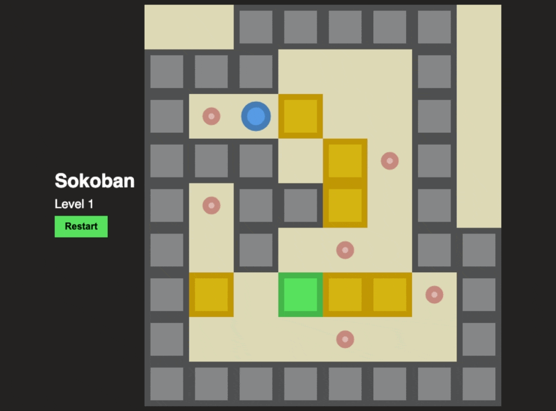

# Sokoban

Sokoban (倉庫番, Souko-ban) is a puzzle video game genre in which the player pushes crates or boxes around in a warehouse, trying to get them to storage locations. 
### [inspired by taniarascia](https://github.com/taniarascia/sokoban)
### [Demo](http://t.tmy.io/sokoban)

